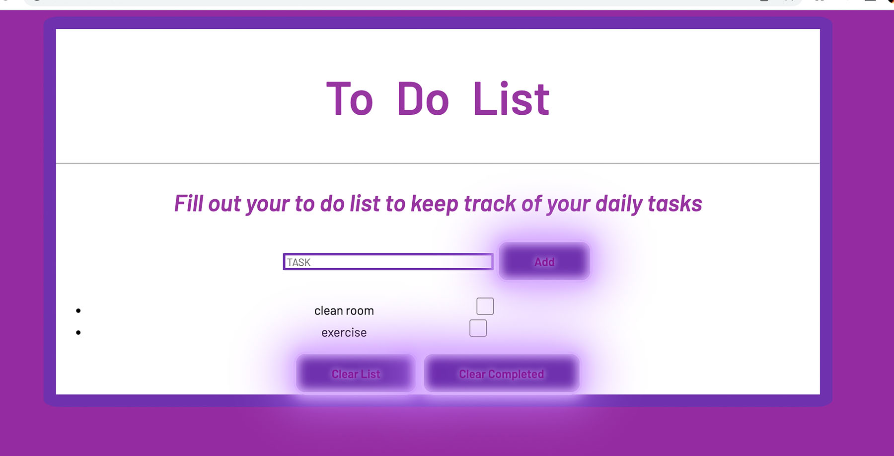

# toDo-PreviousExpress
Login and keep track of your daily task
**Link toProject:** 

## How This Project was Created

JavaScript, Node.js, and MongoDB

## Installation

1. Clone repo
2. run `npm install`

## Usage

1. run `node server.js`
2. Navigate to `localhost:8080`
